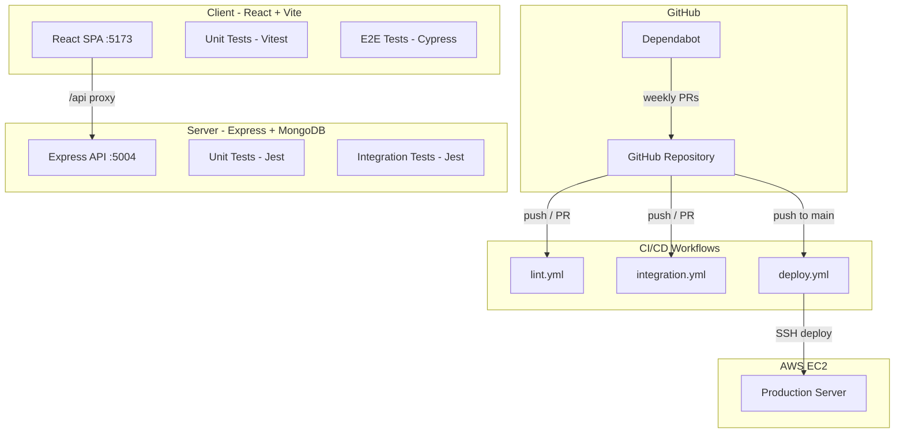
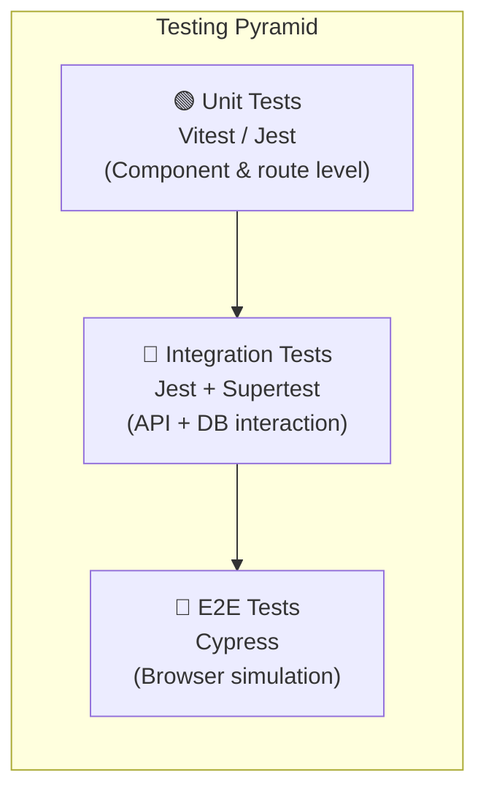
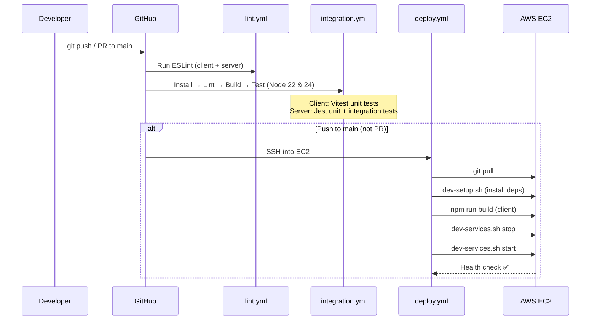

# ShopSmart E-Commerce — Complete Project Walkthrough

## Project Architecture

The project is a **monorepo** with two independent packages:

| Directory | Stack | Port | Purpose |
|-----------|-------|------|---------|
| `client/` | React 18 + Vite + React Router | 5173 (dev) | Frontend SPA |
| `server/` | Express + Mongoose + JWT | 5004 | REST API backend |

In **development**, Vite proxies `/api/*` requests to `localhost:5004` (configured in [vite.config.js](file:///Users/bhavishyamac/Desktop/E-Commerce/client/vite.config.js)). In **production**, [index.js](file:///Users/bhavishyamac/Desktop/E-Commerce/server/src/index.js) serves the built `client/dist` as static files and handles SPA fallback.

---

## GitHub Workflows (CI/CD)

There are **3 workflows** in [.github/workflows/](file:///Users/bhavishyamac/Desktop/E-Commerce/.github/workflows):

### 1. [lint.yml](file:///Users/bhavishyamac/Desktop/E-Commerce/.github/workflows/lint.yml) — Linting Checks

**Triggers:** Push to `main`, Pull Requests to `main`, manual dispatch

**What it does:**
1. Checks out code
2. Sets up Node.js 22.x with npm caching
3. Runs `npm ci` + `npm run lint` on **client** (ESLint with React + Cypress plugins)
4. Runs `npm ci` + `npm run lint` on **server** (ESLint on `src/`)

**Purpose:** Catches syntax errors, unused variables, React hook violations, and JSX issues before code is merged.

---

### 2. [integration.yml](file:///Users/bhavishyamac/Desktop/E-Commerce/.github/workflows/integration.yml) — CI (Build + Test)

**Triggers:** Push to `main`, Pull Requests to `main`, manual dispatch

**What it does (for each Node version in the matrix: 22.x, 24.x):**

| Step | Client | Server |
|------|--------|--------|
| Install | `npm ci` | `npm ci` |
| Lint | `npm run lint` | `npm run lint` |
| Build | `npm run build` (Vite production build) | `npm run build` (no-op, no build script) |
| Test | `npm test` (Vitest unit tests) | `npm test` (Jest unit + integration tests) |

**Key detail:** The server sets `NODE_ENV=test` which **skips the MongoDB connection** in [app.js](file:///Users/bhavishyamac/Desktop/E-Commerce/server/src/app.js) (line 16: `if (process.env.NODE_ENV !== 'test') connectDB()`). Integration tests optionally connect via `MONGODB_URI` secret if available.

---

### 3. [deploy.yml](file:///Users/bhavishyamac/Desktop/E-Commerce/.github/workflows/deploy.yml) — Deploy to EC2

**Triggers:** Push to `main`, manual dispatch

**What it does:**
1. SSHs into the EC2 instance using secrets (`EC2_HOST`, `EC2_USER`, `EC2_SSH_KEY`)
2. Clones the repo if it doesn't exist, otherwise `git pull origin main`
3. Runs [dev-setup.sh](file:///Users/bhavishyamac/Desktop/E-Commerce/shell-scripts/dev-setup.sh) to install dependencies (idempotent)
4. Builds the client with `npm run build`
5. Stops existing services with `dev-services.sh stop`
6. Starts fresh with `dev-services.sh start`

---

## Shell Scripts

### [dev-setup.sh](file:///Users/bhavishyamac/Desktop/E-Commerce/shell-scripts/dev-setup.sh) — Idempotent Dependency Installer

**Purpose:** Safely install npm dependencies for both client and server without redundant work.

**How it works:**
1. Verifies `node` and `npm` are available (exits with error if not)
2. For each directory (`server/`, `client/`):
   - If `node_modules` already exists → **skips** install (idempotent)
   - If missing → runs `npm install`

**Idempotent** means running it multiple times produces the same result — it won't reinstall if already done.

---

### [dev-services.sh](file:///Users/bhavishyamac/Desktop/E-Commerce/shell-scripts/dev-services.sh) — Service Manager

**Usage:** `./dev-services.sh start` or `./dev-services.sh stop`

**[start](file:///Users/bhavishyamac/Desktop/E-Commerce/shell-scripts/dev-services.sh#176-209) command:**
1. Kills any existing process on port 5004 (clean slate)
2. Runs `npm install` in the server directory
3. Starts the backend **detached** with `nohup npm start &`
4. Runs a **health check** — pings `http://localhost:5004/api/health` up to 10 times (2s intervals)
5. If health check fails → exits with error

**[stop](file:///Users/bhavishyamac/Desktop/E-Commerce/shell-scripts/dev-services.sh#213-218) command:**
1. Finds and kills whatever process is using port 5004

Both commands are **idempotent** — safe to run repeatedly.

---

## Testing Strategy

The project has **3 layers** of testing:

### Layer 1: Unit Tests

#### Client — [App.test.jsx](file:///Users/bhavishyamac/Desktop/E-Commerce/client/src/App.test.jsx) (Vitest + React Testing Library)

**Run:** `cd client && npm test`

| Test | What it verifies |
|------|-----------------|
| *"shows loader before fetch resolves"* | Mocks [fetch](file:///Users/bhavishyamac/Desktop/E-Commerce/client/src/context/CartContext.jsx#36-57) with an unresolved Promise → asserts loader spinner is visible |
| *"renders content after fetch"* | Mocks `/api/products/featured` and `/api/categories` → asserts "ShopSmart", "Trending Now", product names render |

**Key technique:** Uses `vi.fn()` to mock `global.fetch`, and mocks `localStorage` since jsdom doesn't provide one.

#### Server — [app.test.js](file:///Users/bhavishyamac/Desktop/E-Commerce/server/tests/app.test.js) (Jest + Supertest)

**Run:** `cd server && npm test`

| Test | What it verifies |
|------|-----------------|
| *"GET /api/health returns 200"* | Sends request to health endpoint → asserts `{ status: 'ok' }` |

**Key detail:** Tests use the exported `app` module (not [index.js](file:///Users/bhavishyamac/Desktop/E-Commerce/server/src/index.js)), so no server is actually started and no DB connection is made.

---

### Layer 2: Integration Tests

#### Server — [integration.test.js](file:///Users/bhavishyamac/Desktop/E-Commerce/server/tests/integration.test.js) (Jest + Supertest + Mongoose)

| Test | What it verifies |
|------|-----------------|
| *"GET /api/products returns products array"* | Hits the products route → asserts `res.body.products` is an array |
| *"GET /api/categories returns 200 or 404"* | Hits categories route → accepts either status code |

**Key detail:** In CI, `MONGODB_URI` secret controls whether a real DB is connected. Without it, the tests run against the Express app directly (which may return empty results but still validates routes work).

---

### Layer 3: E2E Tests

#### Client — [flow.cy.js](file:///Users/bhavishyamac/Desktop/E-Commerce/client/cypress/e2e/flow.cy.js) (Cypress)

**Run:** `cd client && npx cypress run` (headless) or `npx cypress open` (GUI)

| Test | Flow |
|------|------|
| *"load home page and navigate to products"* | Visit `/` → Click "Shop" in navbar → Verify URL is `/products` |
| *"login, browse, add to cart, view cart"* | **Login** (mocked API) → **Browse** products → **Add** first product to cart → **Go to cart** → Verify item appears + "Proceed to Checkout" |
| *"show error on invalid login"* | Submit wrong credentials → Assert error alert appears |
| *"redirect to login without auth"* | Visit `/orders` (protected) → Assert redirect to `/login` |

**Key technique:** Uses `cy.intercept()` to mock all API responses, making tests **independent of database state** — they work in CI without MongoDB.

---

## Dependabot

[dependabot.yml](file:///Users/bhavishyamac/Desktop/E-Commerce/.github/dependabot.yml) is configured to:
- Check **npm** dependencies for both `/client` and `/server`
- Run **weekly**
- Open up to **5 PRs** per directory

This automatically creates PRs when dependencies have newer versions or security patches.

---

## How Everything Connects

**In summary:**
1. Every push/PR runs **linting** and **CI** (build + all tests across 2 Node versions)
2. Pushes to `main` additionally trigger **deployment** to EC2
3. Dependabot keeps dependencies updated via weekly automated PRs
4. Shell scripts ensure the deployment is **idempotent** — safe to re-run without breaking anything
